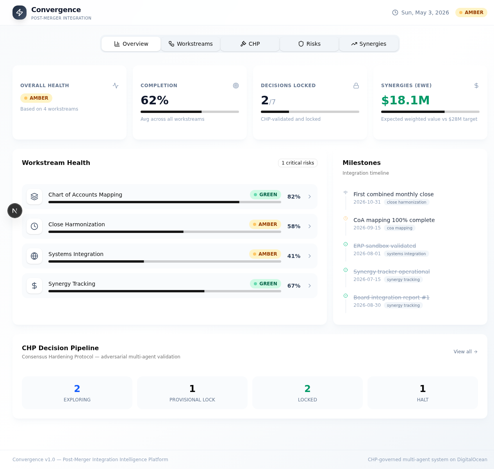
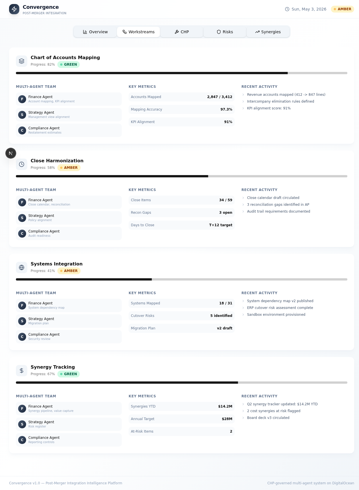
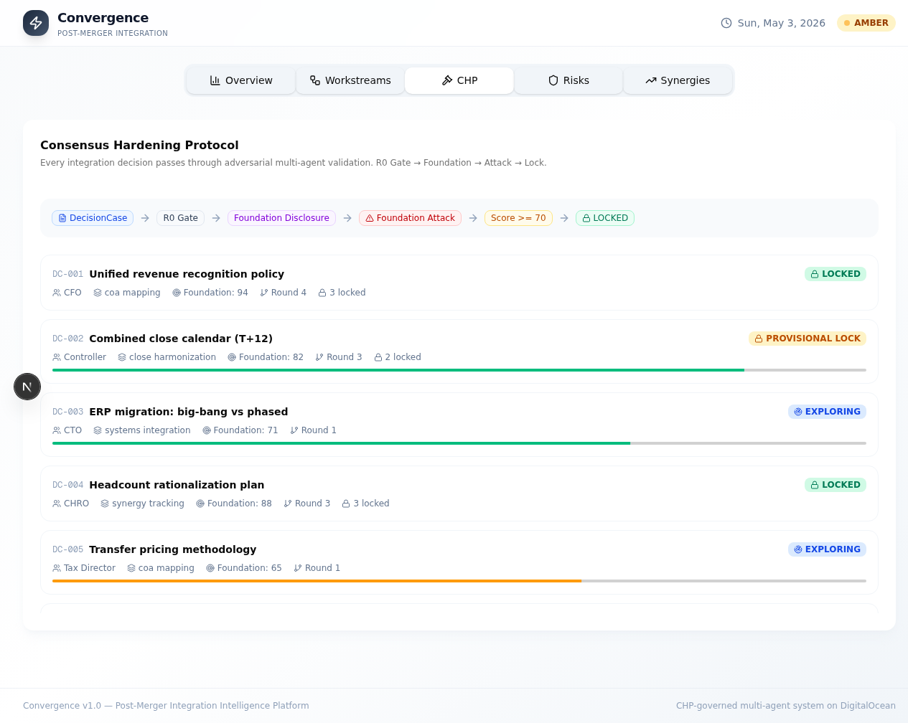
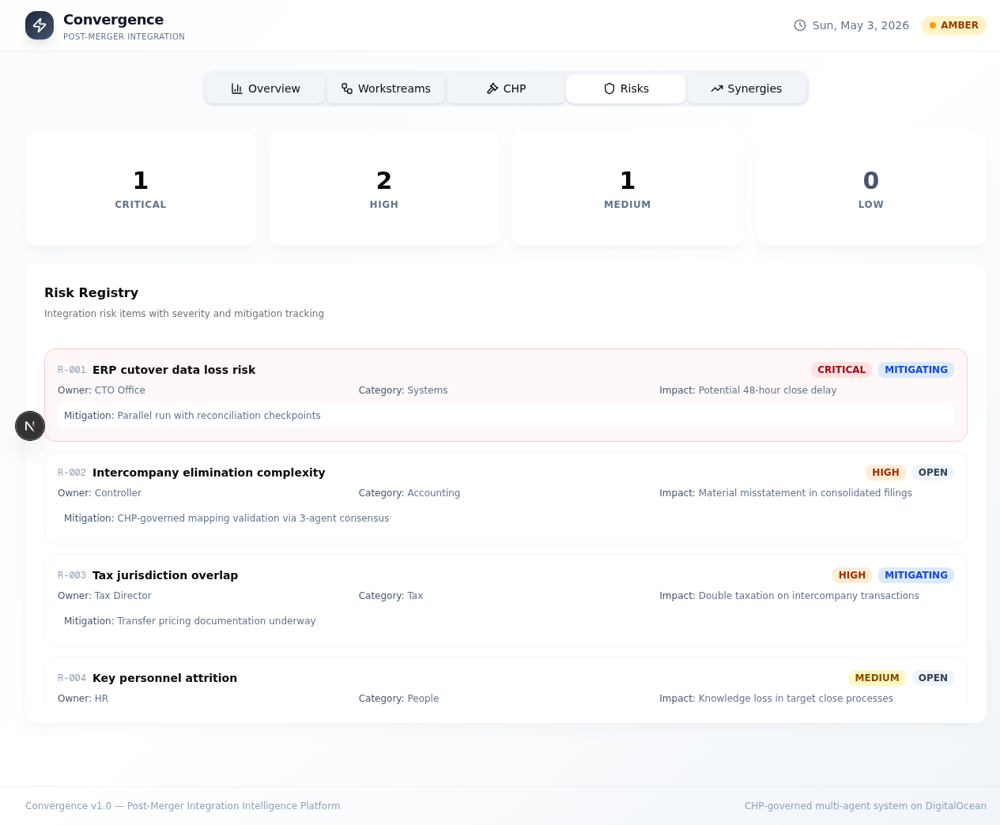
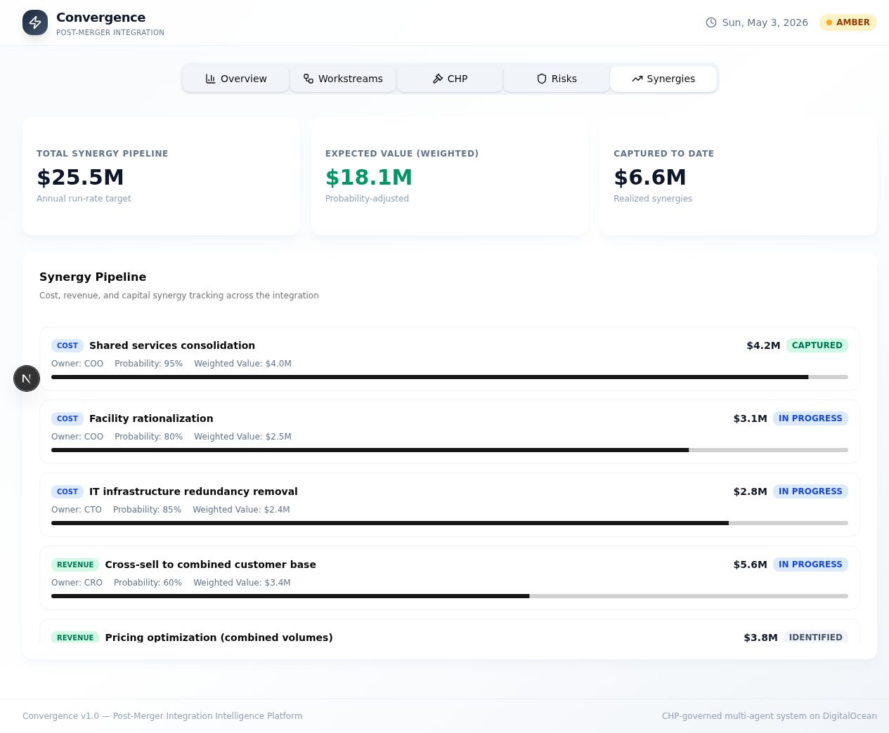

# Convergence

**Post-Merger Integration Intelligence Platform** — CHP-governed multi-agent Convergence for M&A finance integration.

Built on DigitalOcean: App Platform + Managed PostgreSQL + Spaces.

## Dashboard Demo

https://github.com/user-attachments/assets/convergence-dashboard-demo.mp4

### Screenshots

**Overview** — Real-time integration health, workstream status, KPIs, and milestone tracking at a glance.



**Workstreams** — Deep-dive into each of the 4 integration workstreams with multi-agent team details, key metrics, and recent activity.



**CHP Decision Pipeline** — Consensus Hardening Protocol view showing every integration decision through adversarial multi-agent validation from EXPLORING to LOCKED.



**Risk Registry** — Integration risk items with severity classification, owner tracking, impact assessment, and mitigation tracking.



**Synergy Pipeline** — Cost, revenue, and capital synergy tracking with probability-weighted expected value and capture status.



## Architecture

```
Integration Mesh (3 agents per workstream)
    |
    v
Cognitive Mesh Protocol (expansion/compression reasoning)
    |
    v
Consensus Hardening Protocol (EXPLORING -> PROVISIONAL_LOCK -> LOCKED)
    |
    v
Convergence Dashboard (health, risks, milestones, decisions)
```

### 4 Integration Workstreams

| Workstream | Finance Agent | Strategy Agent | Compliance Agent |
|---|---|---|---|
| **Chart of Accounts Mapping** | Account mapping, KPI alignment | Management view alignment | Restatement estimates |
| **Close Harmonization** | Close calendar, reconciliation gaps | Policy alignment | Audit readiness |
| **Systems Integration** | System dependency map, cutover risks | Migration plan | Security review |
| **Synergy Tracking** | Synergy pipeline, value capture | Risk register | Reporting controls |

### DigitalOcean Stack

| Component | Service | Purpose |
|---|---|---|
| API Backend | App Platform (Python/uvicorn) | FastAPI + CHP + Mesh engines |
| Dashboard | App Platform (Next.js) | Convergence UI |
| Database | Managed PostgreSQL 16 | Decisions, mappings, audit trail |
| Storage | Spaces (S3) | Artifacts, CSVs, board decks |
| Inference | GenAI Inference | GPT-oss-20b / Llama 3.3 70B |
| IaC | Terraform | Full infrastructure |

### CHP Decision Flow

```
DecisionCase -> R0 Gate (Solvable/Scoped/Valid/Worth_it)
    |
    v
Foundation Disclosure (1-3 weakest assumptions)
    |
    v
Foundation Attack (adversarial review)
    |
    v
Score >= 70? -> EXPLORING -> PROVISIONAL_LOCK -> LOCKED (via 3rd-party validation)
Score < 70?  -> REFRAME_REQUIRED
R0 fail?     -> HALT
```

### Scoring

- **Overall Health**: RED (any workstream red) / AMBER (any amber) / GREEN (all green)
- **Foundation Score**: 0-100 (>= 70 to proceed, >= 100 for clean CFO lock)
- **Accuracy Guard**: Floor enforcement — forces human verification below threshold

## Quick Start

```bash
# Install
pip install -e ".[dev]"

# Run tests
pytest tests/ -v

# Run API
uvicorn convergence.api.main:app --reload

# Run with DO inference (requires MODEL_ACCESS_KEY)
MODEL_ACCESS_KEY=doo_v1_... uvicorn convergence.api.main:app --reload
```

## API Endpoints

| Method | Path | Description |
|---|---|---|
| GET | `/api/v1/health` | Health check |
| GET | `/api/v1/convergence` | Integration health dashboard data |
| POST | `/api/v1/convergence/init` | Initialize Convergence for a deal |
| GET | `/api/v1/workstreams` | List all workstreams |
| POST | `/api/v1/workstreams/{type}/analyze` | Run multi-agent analysis |
| GET | `/api/v1/decisions` | List all CHP decisions |
| POST | `/api/v1/decisions/{id}/validate` | Third-party validation (lock promotion) |

## Deployment

```bash
cd terraform/
terraform init
terraform apply -var="do_token=$DIGITALOCEAN_API_TOKEN" -var="environment=prod"
```

## Project Structure

```
src/convergence/
  chp/                # Consensus Hardening Protocol (gates, payloads, lock)
  mesh/               # Cognitive Mesh (agents, protocol, context, playbook)
  workstreams/        # 4 M&A integration workstreams
  convergence_tower/  # Health scoring, risks, milestones
  inference/          # DO GenAI client (OpenAI-compatible)
  db/                 # SQLite/PostgreSQL persistence
  api/                # FastAPI backend
dashboard/            # Next.js Convergence UI
  screenshots/        # Dashboard screenshots
  app/                # Next.js pages
tests/                # 129 tests
terraform/            # DO infrastructure
```

## License

MIT

---

## CHP Governance

This repository is hardened with the [Consensus Hardening Protocol (CHP)](https://codeberg.org/cubiczan/consensus-hardening-protocol), Cubiczan's decision-governance layer for multi-agent AI systems.

### Protocol Layers
- **R0 Gate**: All decisions must pass Solvable, Scoped, Valid, Worth_it checks
- **Foundation Disclosure**: 1-3 weakest assumptions, 1-2 invalidation conditions, 1 key vulnerability
- **Adversarial Layer**: Mandatory devil's advocate at Phase 0 and Round 3
- **State Machine**: EXPLORING → PROVISIONAL → PROVISIONAL_LOCK → LOCKED
- **Third-Party Validation**: Independent CONFIRM/REJECT before lock

### Domain Configuration
- **Category**: Finance (CFO Accuracy)
- **Foundation Threshold**: 100
- **CFO Accuracy Guard**: Enabled

### Compliance Artifacts
| File | Purpose |
|------|---------|
| `.chp/STATE_MACHINE.md` | Decision state transitions |
| `.chp/R0_CONFIG.yaml` | Domain-calibrated thresholds |
| `.chp/ADVERSARIAL_PROMPTS.md` | Standardized challenge templates |
| `.chp/CHP_COMPLIANCE.md` | Compliance tracking & audit trail |

### CHP Version
cognitive-mesh-orchestrator 0.1.0 | [Protocol Docs](https://codeberg.org/cubiczan/consensus-hardening-protocol)

